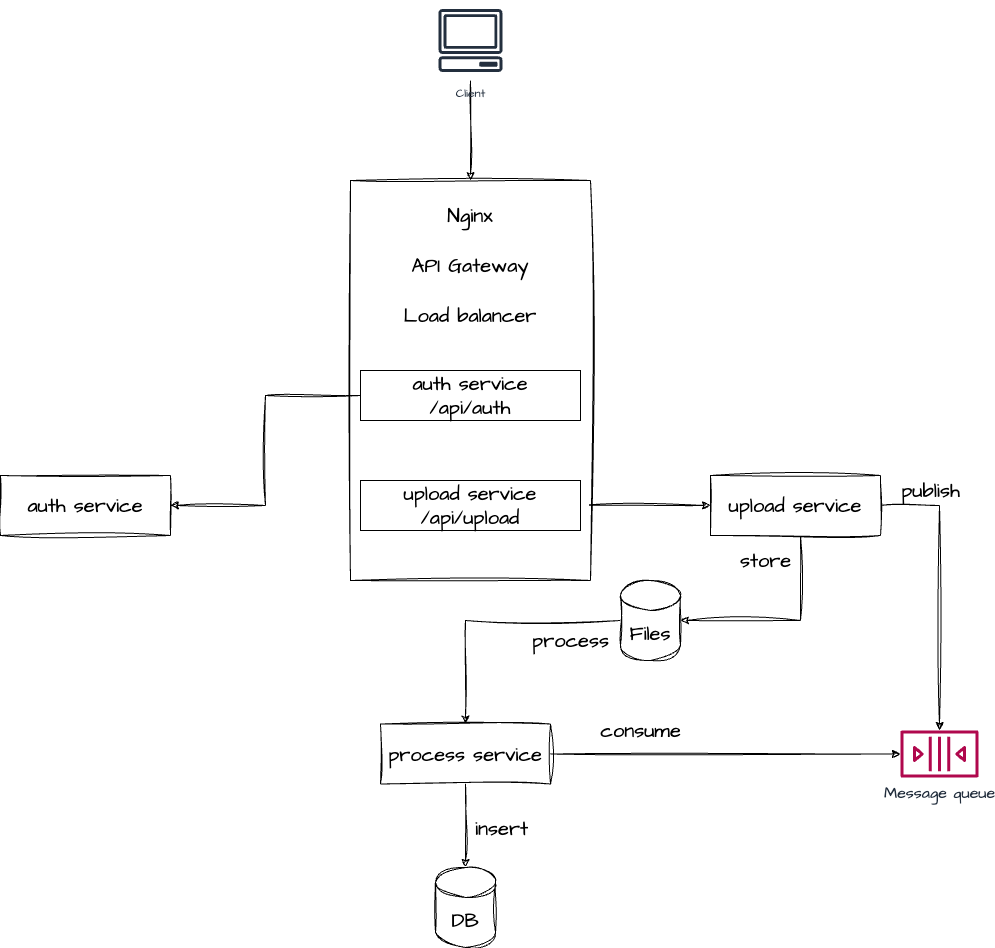
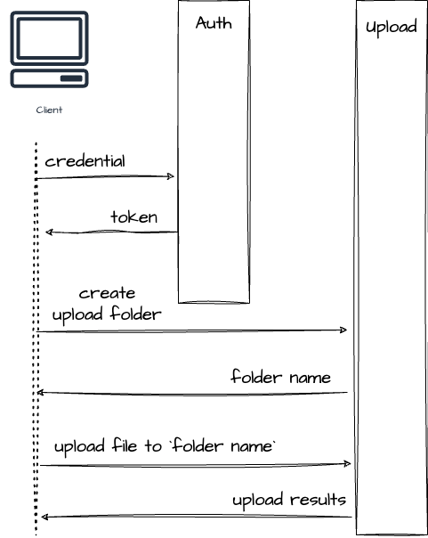
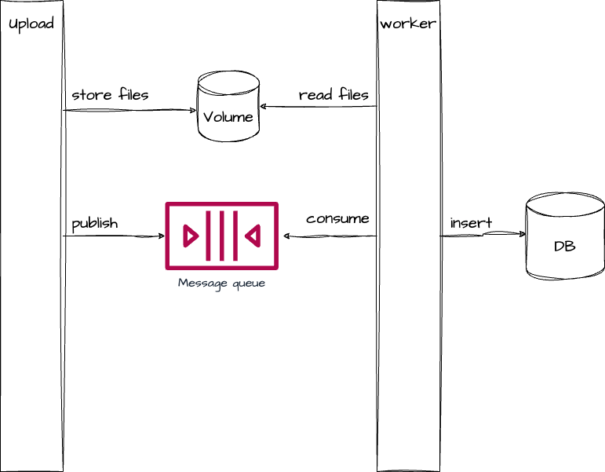

## Introduction

#### Architecture

##### High-level architecture

The image below shows the high-level architecture of the project. The project consists of 3 services: upload-service, process-service, and auth-service.

- The auth-service is responsible for handling client authentication.

- The upload-service is responsible for handling the process of uploading files.

- The process-service is responsible for handling the process of inserting data to database.

The upload-service and process-service communicate with each other via RabbitMQ.



#### Workflow

Two images below shows the workflow of authentication and uploading process.

Firstly, the client need to request a JWT from the auth-service.

To request to other services, the client must include an authorization token.

Assume that we have a huge file that need to upload to the server. The client will split the file into smaller files and upload them to the server.

To make sure that we can reassemble the file, the client will call a `/api/upload` at the begining to create the folder. The server will return a folder name. The client will use this name to upload the files.

The client will upload the files to the server via `/api/upload/{folder_name}`.




The upload-service will store the file and notify the process-service via RabbitMQ - as the message contains file name. The process-service will process the file and insert the data to database.



#### Principle & Practices

- Deploy Nginx as an API Gateway

- Use Docker to containerize the services

- Use design patterns to build the services: singleton, decorator, and factory.

#### Security practices

- Authentication with JWT, the token will live for 1 hour.

- Input Validation: the server will validate the file, specifically the file size and the file type.

- Renaming File: the server will rename the file with uuid to prevent the attacker from guessing the file name.

- Store uploaded files outside the web root folder. The directory to which files are uploaded should be outside of the website’s public directory so that the attackers cannot execute the file via the assigned path URL.

- Configuring Basic Rate Limiting: maximum of 100 requests per second will be allowed from each unique IP address. I have also set burst to 200, allowing a temporary burst of 200 requests to be processed without returning errors.

- Validate csv file before inserting data to database.

TODO:

- <input type="checkbox" disabled /> Check for vulnerabilities in files
- <input type="checkbox" disabled /> Scan for malware
- <input type="checkbox" disabled /> Integrate Authentication with API Gateway

#### Code structure

<pre>
.
├── auth-service
│   ├── Dockerfile
│   ├── README.md
│   ├── app
│   │   ├── api
│   │   ├── core
│   │   ├── main.py
│   │   ├── models
│   │   │   ├── attributes
│   │   │   ├── domains
│   │   │   └── schemas
│   │   └── service
│   ├── requirements.txt
│   ├── setup.cfg
│   └── tests
├── db
│   ├── Dockerfile
│   └── init-scripts
│       └── init-table.sql
├── postman
│   └── collection.json
├── process-service
│   ├── Dockerfile
│   ├── README.md
│   ├── app
│   │   ├── core
│   │   ├── main.py
│   │   ├── models
│   │   │   ├── attributes
│   │   │   ├── domains
│   │   │   └── schemas
│   │   └── services
│   ├── requirements.txt
│   ├── setup.cfg
│   ├── tests
│   └── wait-for-rabbitmq.sh
├── tests
│   ├── data
│   │   └── generator.py
│   ├── test.sh
│   └── test_api.py
└── upload-service
│    ├── Dockerfile
│    ├── README.md
│    ├── app
│    │   ├── api
│    │   ├── core
│    │   ├── main.py
│    │   ├── models
│    │   │   ├── attributes
│    │   │   ├── domains
│    │   │   └── schemas
│    │   ├── service
│    │   ├── tests
│    │   └── utils
│    ├── requirements.txt
│    ├── setup.cfg
├── docker-compose.yaml
├── nginx_config.conf
├── README.md
├── requrirements.txt
</pre>

##### Folder Explaination:

- auth-service: a service that handles user authentication and authorization.

- db: contains the Dockerfile to build the PostgreSQL database image and a script to inital the database.

- postman: contains the Postman collection to test the APIs.

- process-service: a service that handles the process of inserting data to database.

- tests: contains the test scripts and the script to generate dummy data.

- upload-service: a service that handles the process of uploading files.


#### Key libraries & Frameworks

To build such a service, I used the following libraries and frameworks.

For Infrastucure:

- FastAPI: a modern, fast (high-performance), web framework for building APIs with Python 3.6+ based on standard Python type hints.

- PostgreSQL: a powerful, open source object-relational database system.

- RabbitMQ: a message broker that implements the Advanced Message Queuing Protocol (AMQP).

- Nginx: a web server that can also be used as a reverse proxy, load balancer, mail proxy and HTTP cache.

For Coding:

- aiopika: a pure-Python, thread-safe, asyncio-compatible AMQP client library.

- PyJWT: a Python library which allows you to encode and decode JSON Web Tokens (JWT).

- psycopg2: a popular PostgreSQL database adapter for the Python programming language.


#### Installation

To run this project, you need to install Docker and Docker Compose on your machine.

Run the following command to start the project:

```
docker-comppose up -d
```

For testing, you need to install the dependencies by the following command:

```
pip install -r requirements.txt
```


#### Testing

Before testing, you need to generate dummy data by running the following command:


```
python ./tests/data/generator.py
```

By defaults, the script will generate 1,000,000 dummy records, and split into serveral files. You can change the number of records by passing the `--num_records` argument.

```
python ./tests/data/generator.py --num_records 2000000
```

To test the project, you need to run the following command:

```
pytest
```

Or

```
chmod +x ./tests/test.sh

./tests/test.sh
```

NOTE: The test script will take a long time to finish as it also generate dummy data.


#### Resources

##### Swagger UI

Access to Swagger UI to view the APIs:

[Upload APIs](http://localhost:8080/api/upload/docs)

[Auth APIs](http://localhost:8080/api/auth/docs)

##### pgAdmin UI

Access to pgAdmin to view the database:

```
http://localhost:5050
```

- Username: `admin@admin.com`

- Password: `root`

#### Clean up

```
docker-compose down --volumes --rmi 'all'
```